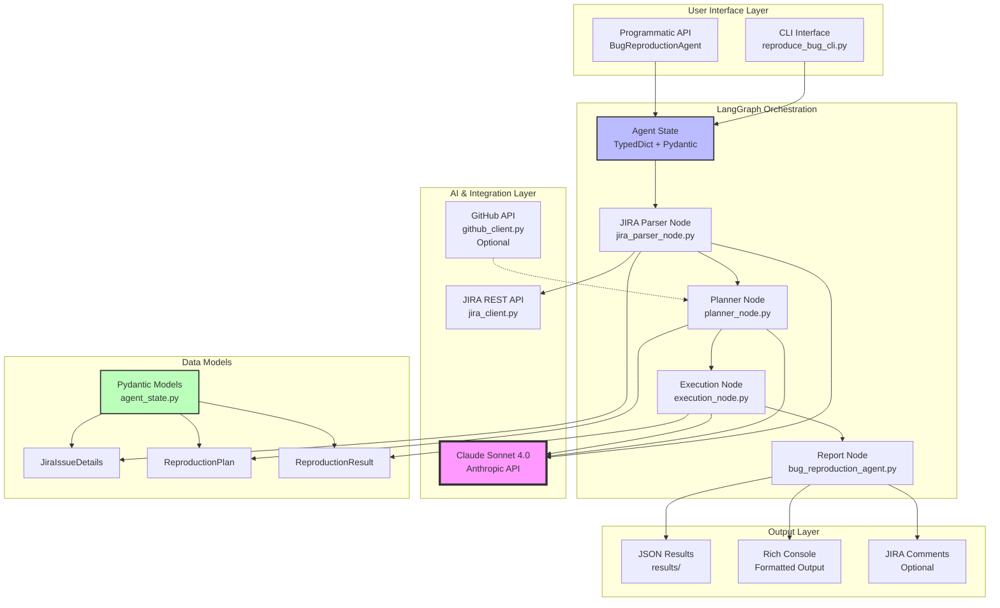
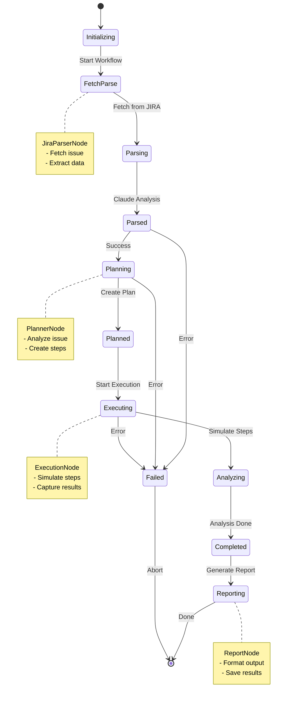
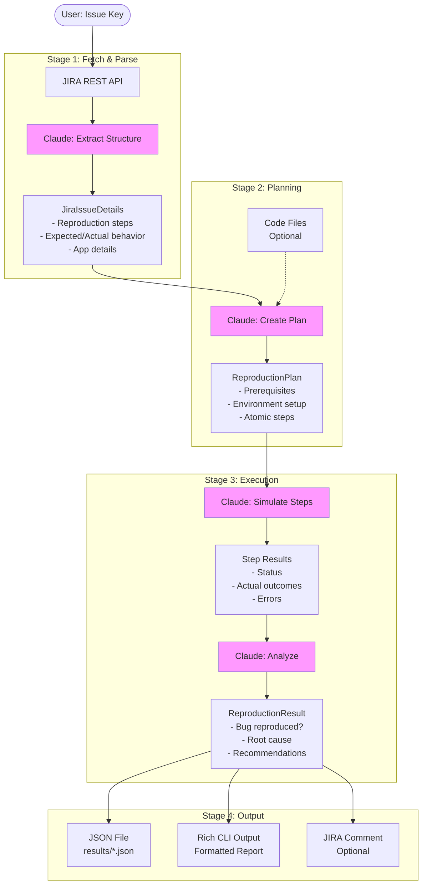
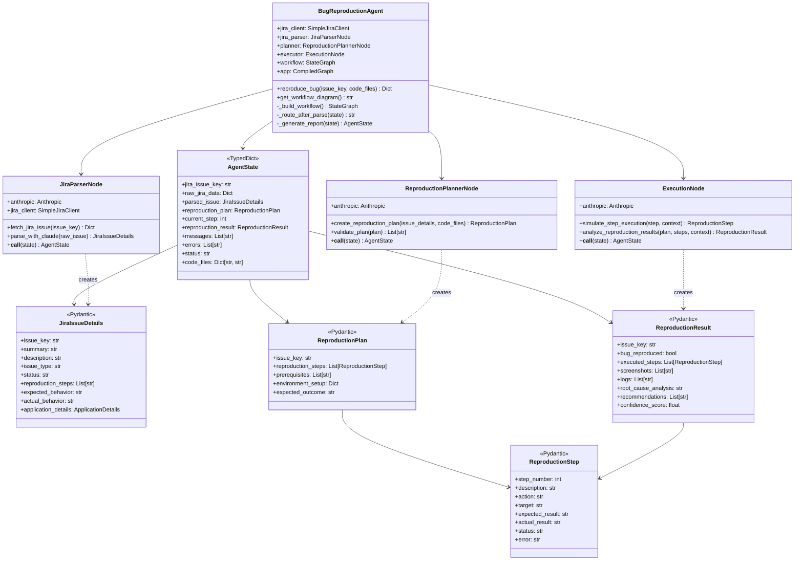
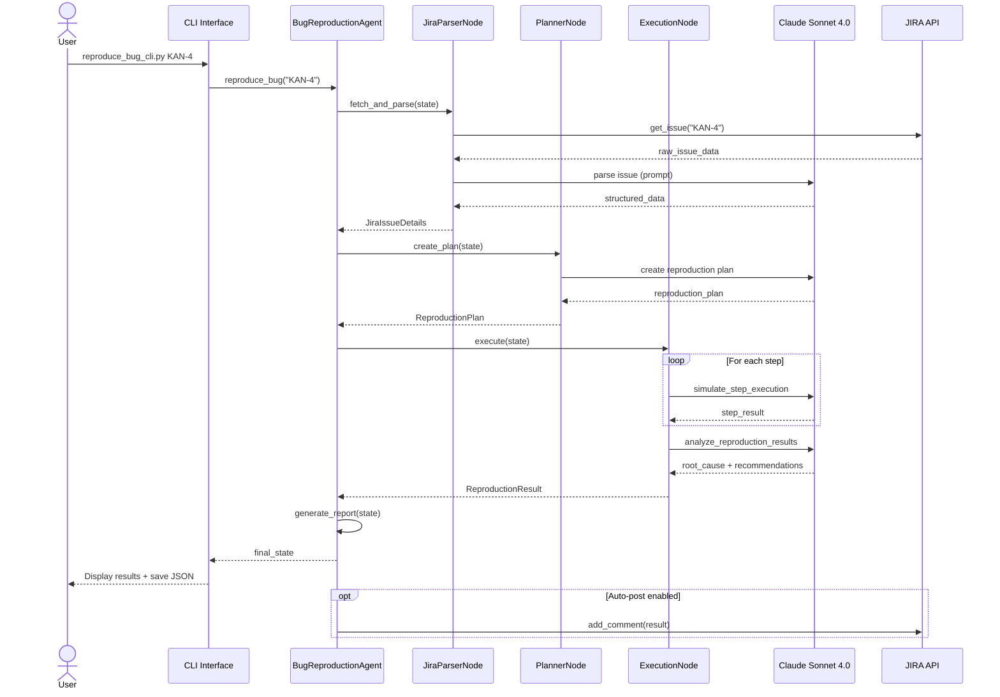
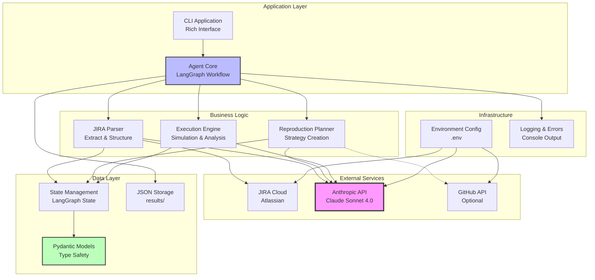
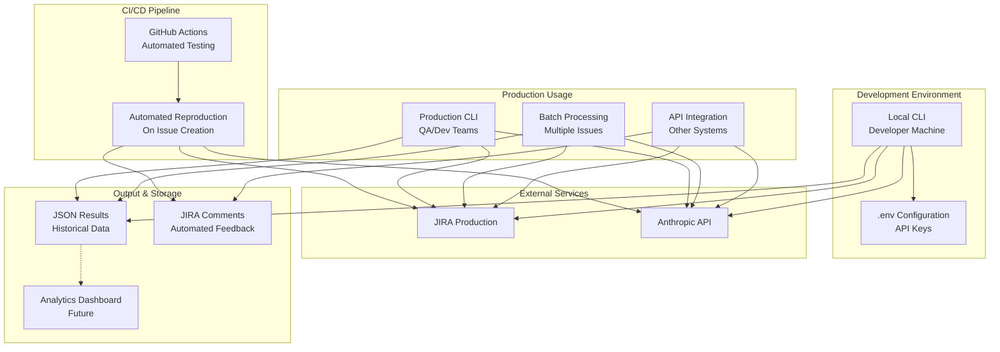

# Bug Reproduction Agent - Architecture Diagrams (Mermaid)

## System Architecture

## LangGraph Workflow

## Node Architecture

```mermaid
graph LR
    subgraph "JIRA Parser Node"
        INPUT1[Input: issue_key]
        FETCH[Fetch from JIRA API]
        PARSE[Parse with Claude]
        OUTPUT1[Output: JiraIssueDetails]
        
        INPUT1 --> FETCH
        FETCH --> PARSE
        PARSE --> OUTPUT1
    end
    
    subgraph "Planner Node"
        INPUT2["Input: JiraIssueDetails\n+ code_files"]
        ANALYZE["Analyze Issue"]
        CREATE["Create Plan\nwith Claude"]
        VALIDATE[Validate Plan]
        OUTPUT2[Output: ReproductionPlan]
        
        INPUT2 --> ANALYZE
        ANALYZE --> CREATE
        CREATE --> VALIDATE
        VALIDATE --> OUTPUT2
    end
    
    subgraph "Execution Node"
        INPUT3[Input: ReproductionPlan]
        LOOP[For Each Step]
        SIMULATE[Simulate with Claude]
        CAPTURE[Capture Result]
        FINAL[Analyze All Results]
        OUTPUT3[Output: ReproductionResult]
        
        INPUT3 --> LOOP
        LOOP --> SIMULATE
        SIMULATE --> CAPTURE
        CAPTURE --> LOOP
        LOOP --> FINAL
        FINAL --> OUTPUT3
    end
    
    OUTPUT1 --> INPUT2
    OUTPUT2 --> INPUT3
```

## Data Flow

## Class Diagram

## Sequence Diagram

## Component Interaction

## Deployment Architecture

